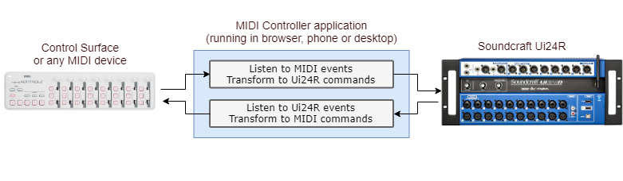

# MIDI Controller for Soundcraft Ui24R

The aim of this project is to create a MIDI controller for [Soundcraft Ui24R](https://www.soundcraft.com/en/products/ui24r) mixing console. It doesn't currently support MIDI control. The controller would connect the MIDI device (control surface) to the Ui24R console and translate the MIDI commands to the native commands or the opposite way, based on configurable
device profiles.

## Current Status
> The project is currently in the *ALPHA* phase, the application skeleton is ready, it already listens to connected MIDI devices, shows incoming MIDI messages, the device profile manager is being prepared, also the rules editor which will drive the controller service that will transform the input to output.

## Current Goals
* Connect to console using IP or address
* Find existing MIDI devices, select one and connect
* Persist the setting after closing the application
* Allow mapping incoming MIDI commands to native commands for the console
* Allow listening to the console parameters and map them to outgoing MIDI commands
* Make the UI as much intuitive as possible, drag & drop or visual
* Allow configuration sets - settings for each device
* Allow some "MIDI learn" functionality that will help with configuration

## Future goals
* once the config format will be stabile the community can help creating setting for various common devices
* talk to the producer and maybe suggest integrating the app into the console, this could work with the USB to MIDI adapter connected directly to the console

## Technical details
* Core framework - [Angular](https://angular.io/)
* State management (redux) - [Reactive Extensions for Angular](https://github.com/ngrx)
* MIDI support - [Web MIDI Api](https://webaudio.github.io/web-midi-api/)
* Multiplatform support (Linux, Windows, OSX) - [Electron](https://electronjs.org/)
* Responsive layout and styling - [Bootstrap](http://getbootstrap.com/)
* Unit and E2E testings - [Jasmine](https://jasmine.github.io/), [Karma](https://karma-runner.github.io/2.0/index.html)
* Continuous integration - [Travis CI](https://travis-ci.org/)
* Code quality - [Coveralls](https://coveralls.io/), [Codebeat](https://codebeat.co)

## Donate
If you want to support send me a beer, it keeps my mind relaxed and ideas will come :-)

